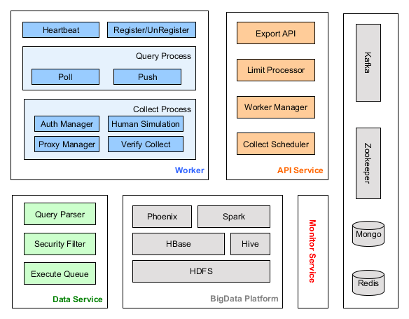

= Open Micro-DataSet Platform(开源微数据平台)

image::https://img.shields.io/travis/MDataSet/mds.svg[link="https://travis-ci.org/MDataSet/mds"]

== 平台优势

. 免费：所有数据均可免费获取
. 开源：提交完整的数据采集、处理、存储及查询实现
. 友好：各类数据源使用JSON格式向外提供数据
. 即时：提供WebSocket实现，实时推送数据

== 架构设计

. 可扩展：数据处理、存储及查询基于主流大数据技术，可方便地实现扩展及伸缩
. 简单：框架实现了各类复杂处理，让数据开发更聚焦业务实现
. 稳定：每个数据源均为独立组件，互不干扰，某个组件crash并不影响整体运行

== 文档

http://MDataSet.github.io/mds[http://MDataSet.github.io/mds]

== Authors and Contributors

* gudaoxuri(i@sunisle.org)

== License

Under version 2.0 of the http://www.apache.org/licenses/LICENSE-2.0[Apache License].